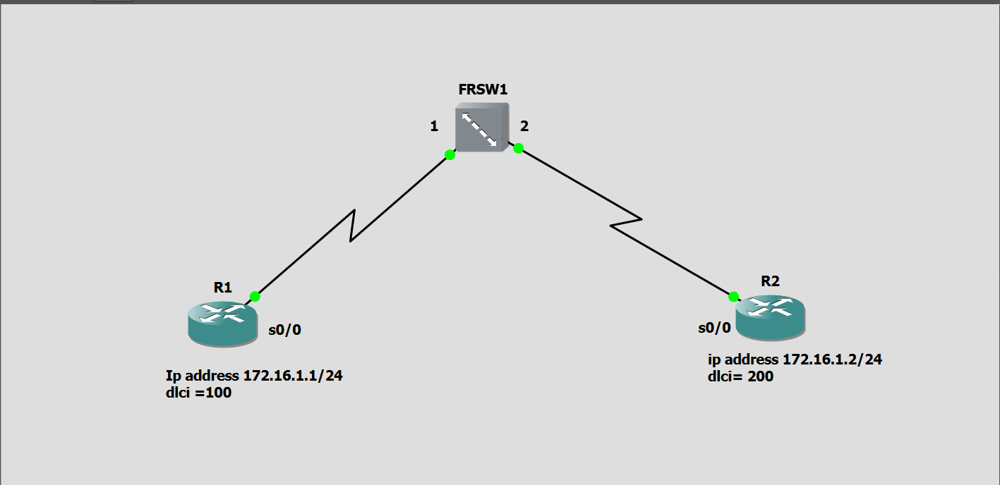
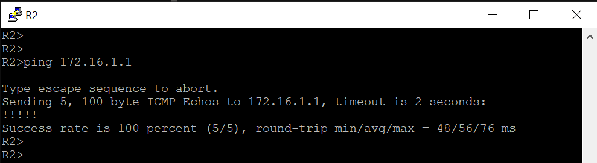

# Exercice 1 — Simple configuration avec Switch FR

## Topologie

| Routeur | Adresse IP | DLCI |
|---|---|---|
| R1 | 172.16.1.1/24 | 100 |
| R2 | 172.16.1.2/24 | 200 |

**Mapping sur le switch Frame Relay (FRSW1) :**
- Source : Port 1, DLCI 100
- Destination : Port 2, DLCI 200

## Objectif

Établir une liaison Frame Relay simple entre deux routeurs à travers un switch Frame Relay, et vérifier la connectivité IP de bout en bout.

## Configuration

Voir les fichiers [R1-config.txt](R1-config.txt) et [R2-config.txt](R2-config.txt).

## Conclusion

Les quatre vérifications confirment le bon fonctionnement de la liaison : circuit virtuel actif, correspondance IP/DLCI découverte dynamiquement via Inverse ARP, route directement connectée, et connectivité IP confirmée par ping.

## 📸 Captures d'écran

### Test de connectivité (ping)

### show frame-relay pvc

### show frame-relay map

### show ip route
