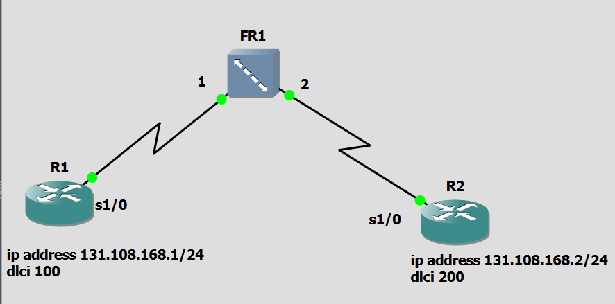
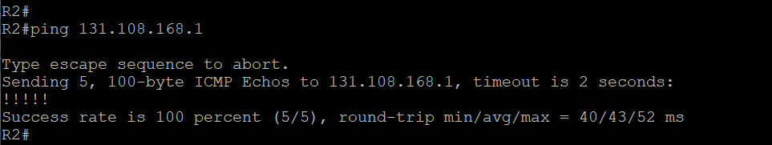

A# Exercice 2 — Configuration point-à-point (deux routeurs) via un Switch

## Topologie (capture d'écran)



| Routeur | Adresse IP | DLCI |
|---|---|---|
| R1 | 131.108.168.1/24 | 100 |
| R2 | 131.108.168.2/24 | 200 |

**Mapping sur le switch Frame Relay (FRSW1) :**
- Source : Port 1, DLCI 100
- Destination : Port 2, DLCI 200

## 📂 Structure

```
exercice2/
├── README.md
├── R1-config.txt
├── R2-config.txt
└── captures/
    ├── topologie.png
    ├── ping.png
    ├── show frame-relay pvc.png
    ├── show frame-relay map.png
    └── show ip route.png
```

## Objectif

Reproduire une liaison Frame Relay point-à-point entre deux routeurs à travers un switch Frame Relay, avec un adressage différent de l'Exercice 1, afin de consolider la méthode de configuration.

> **Note :** cet exercice utilise exactement la même logique de configuration que l'Exercice 1 (même structure de commandes, DLCI identiques). Seule l'adresse IP change. Le terme "point-à-point" désigne ici une interface qui ne communique qu'avec un seul voisin — par opposition au mode "multipoint" vu plus loin dans le TP (Exercices 8 et 9), où une même interface dialogue avec plusieurs routeurs via plusieurs DLCI/mappings distincts.

## Configuration

Voir les fichiers [R1-config.txt](R1-config.txt) et [R2-config.txt](R2-config.txt).

## Conclusion

Les vérifications (`ping`, `show frame-relay pvc`, `show frame-relay map`, `show ip route`) confirment le bon fonctionnement de la liaison, avec un comportement identique à l'Exercice 1 malgré le changement d'adressage IP.

## 📸 Captures d'écran

### Test de connectivité (ping)


### show frame-relay pvc


### show frame-relay map


### show ip route
