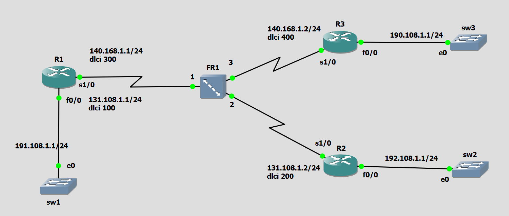
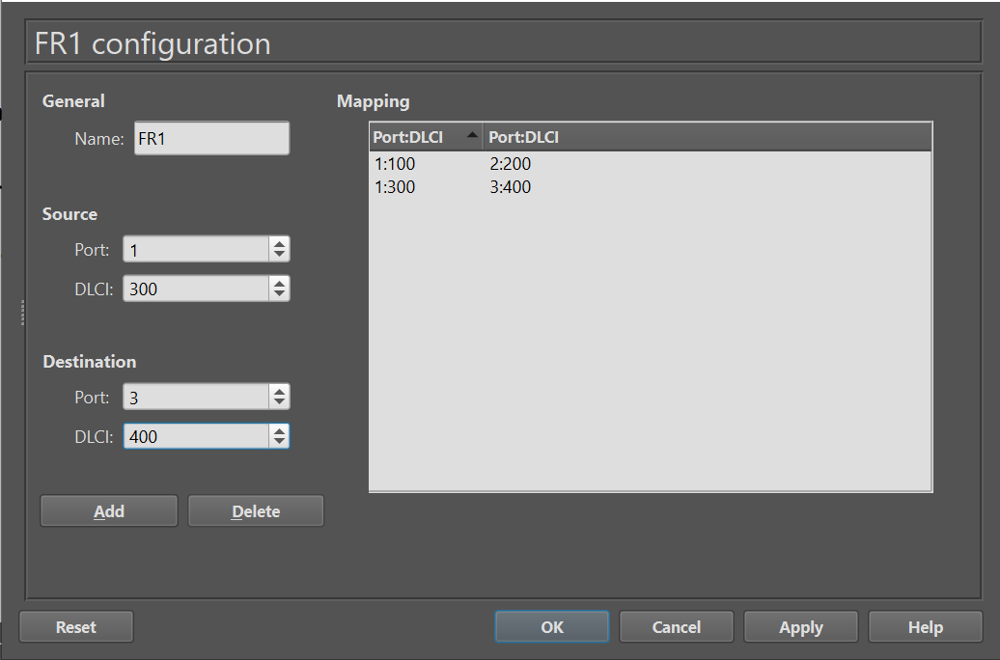
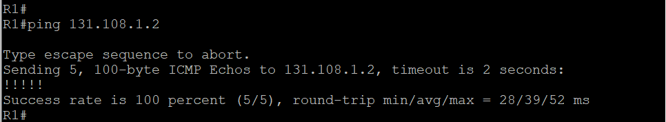
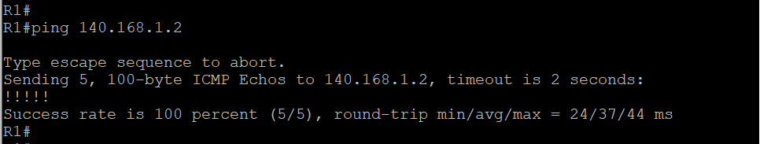

# Exercice 3 — Configuration point-à-point (trois routeurs) avec Switch

## Topologie (capture d'écran)



| Routeur | Interface | Adresse IP | DLCI | Réseau LAN |
|---|---|---|---|---|
| R1 | s1/0.1 | 140.168.1.1/24 | 300 (→ R3) | 191.108.1.0/24 (f0/0) |
| R1 | s1/0.2 | 131.108.1.1/24 | 100 (→ R2) | — |
| R2 | s1/0 | 131.108.1.2/24 | 200 (→ R1) | 192.108.1.0/24 (f0/0) |
| R3 | s1/0 | 140.168.1.2/24 | 400 (→ R1) | 190.108.1.0/24 (f0/0) |

**Mapping sur le switch Frame Relay (FR1) :**
- Port 1 (R1), DLCI 100 ↔ Port 2 (R2), DLCI 200
- Port 1 (R1), DLCI 300 ↔ Port 3 (R3), DLCI 400

## 📂 Structure

```
exercice3/
├── README.md
├── R1-config.txt
├── R2-config.txt
├── R3-config.txt
├── FR1-config.txt
└── captures/
    ├── topologie.png
    ├── fr1-mapping.png
    ├── ping-R1-R2.png
    ├── ping-R1-R3.png
    ├── show frame-relay pvc.png
    ├── show frame-relay map.png
    └── show ip route.png
```

## Objectif

Configurer une liaison Frame Relay point-à-point entre trois routeurs (R1 étant relié à la fois à R2 et R3 via deux circuits virtuels distincts sur la même interface physique, grâce aux sous-interfaces), et mettre en place RIP v2 pour le routage dynamique entre les trois réseaux LAN.

> **Point clé :** R1 utilise deux sous-interfaces (`s1/0.1` et `s1/0.2`), chacune avec son propre DLCI et sa propre adresse IP, car une interface physique classique ne peut porter qu'une seule adresse IP à la fois.

## Configuration

Voir les fichiers [R1-config.txt](R1-config.txt), [R2-config.txt](R2-config.txt), [R3-config.txt](R3-config.txt) et [FR1-config.txt](FR1-config.txt).

## Conclusion

Les vérifications confirment le bon fonctionnement de la liaison multipoint sur R1 (deux PVC actifs simultanément) ainsi que la propagation correcte des routes via RIP : R1 apprend les réseaux de R2 et R3, et inversement, sans configuration statique.

## 📸 Captures d'écran

### Mapping du switch Frame Relay (FR1)


### Test de connectivité R1 ↔ R2


### Test de connectivité R1 ↔ R3


### show frame-relay pvc


### show frame-relay map


### show ip route
