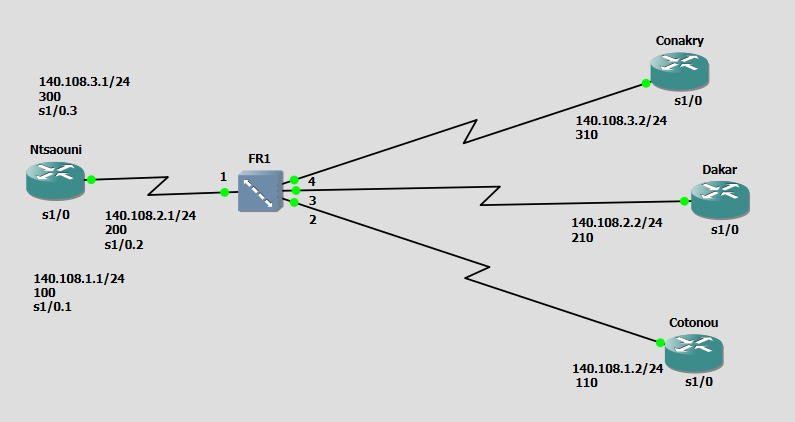
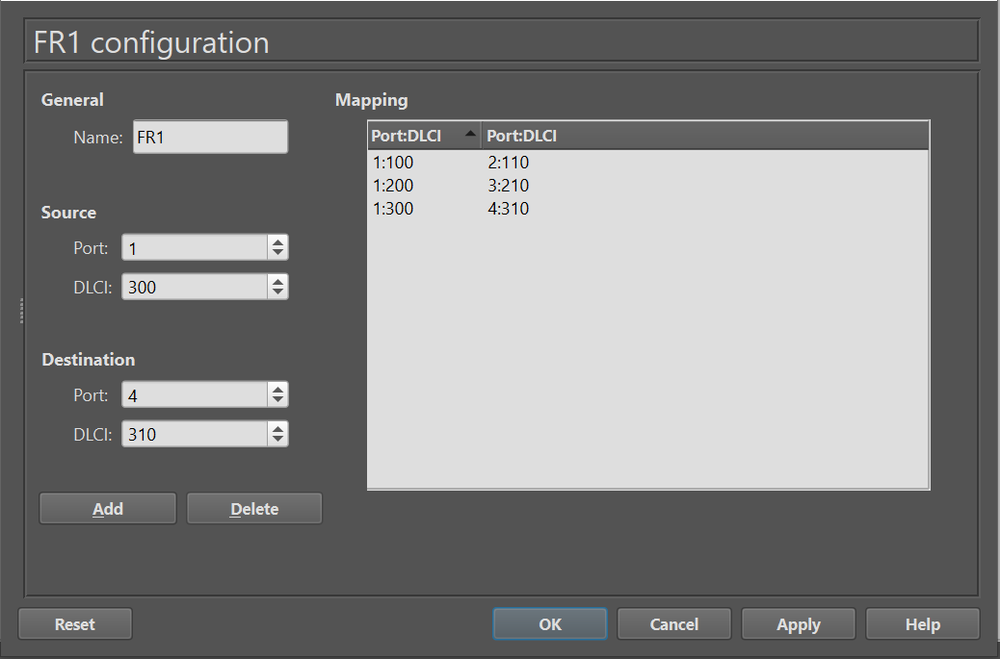

# Exercice 4 — Configuration point-à-point (quatre routeurs) avec Switch

## Topologie (capture d'écran)



| Routeur | Interface | Adresse IP | DLCI | Relié à |
|---|---|---|---|---|
| Ntsaoueni | s1/0.1 | 140.108.1.1/24 | 100 | Cotonou |
| Ntsaoueni | s1/0.2 | 140.108.2.1/24 | 200 | Dakar |
| Ntsaoueni | s1/0.3 | 140.108.3.1/24 | 300 | Conakry |
| Cotonou | s1/0 | 140.108.1.2/24 | 110 | Ntsaoueni |
| Dakar | s1/0 | 140.108.2.2/24 | 210 | Ntsaoueni |
| Conakry | s1/0 | 140.108.3.2/24 | 310 | Ntsaoueni |

**Mapping sur le switch Frame Relay (FR1) :**
- Port 1 (Ntsaoueni), DLCI 100 ↔ Port 2 (Cotonou), DLCI 110
- Port 1 (Ntsaoueni), DLCI 200 ↔ Port 3 (Dakar), DLCI 210
- Port 1 (Ntsaoueni), DLCI 300 ↔ Port 4 (Conakry), DLCI 310

## 📂 Structure

```
exercice4/
├── README.md
├── Ntsaoueni-config.txt
├── Cotonou-config.txt
├── Dakar-config.txt
├── Conakry-config.txt
├── FR1-config.txt
└── captures/
    ├── topologie.png
    ├── fr1-mapping.png
    ├── ping-Ntsaoueni-Cotonou.png
    ├── ping-Ntsaoueni-Dakar.png
    ├── ping-Ntsaoueni-Conakry.png
    ├── show frame-relay pvc/
    │   ├── 0.1.png
    │   ├── 0.2.png
    │   └── 0.3.png
    ├── show frame-relay map.png
    └── show ip route.png
```

## Objectif

Étendre la topologie de l'Exercice 3 à quatre routeurs : Ntsaoueni joue le rôle de routeur central et communique avec Cotonou, Dakar et Conakry via trois circuits virtuels distincts sur sa seule interface physique, grâce à trois sous-interfaces point-à-point. RIP est activé sur le réseau 140.108.0.0 pour que les routeurs périphériques puissent aussi se joindre entre eux.

> **Point clé :** Cotonou, Dakar et Conakry ne sont pas reliés directement entre eux. Leur connectivité mutuelle passe par Ntsaoueni, qui apprend et relaie les routes via RIP.

## Configuration

Voir les fichiers [Ntsaoueni-config.txt](Ntsaoueni-config.txt), [Cotonou-config.txt](Cotonou-config.txt), [Dakar-config.txt](Dakar-config.txt), [Conakry-config.txt](Conakry-config.txt) et [FR1-config.txt](FR1-config.txt).

## Conclusion

Les trois PVC de Ntsaoueni sont actifs simultanément et RIP propage correctement les routes : chaque routeur périphérique joint les deux autres à travers le routeur central, sans configuration de route statique.

## 📸 Captures d'écran

### Mapping du switch Frame Relay (FR1)


### Test de connectivité (ping)


### show frame-relay pvc (les 3 circuits virtuels)


### show frame-relay map


### show ip route
-