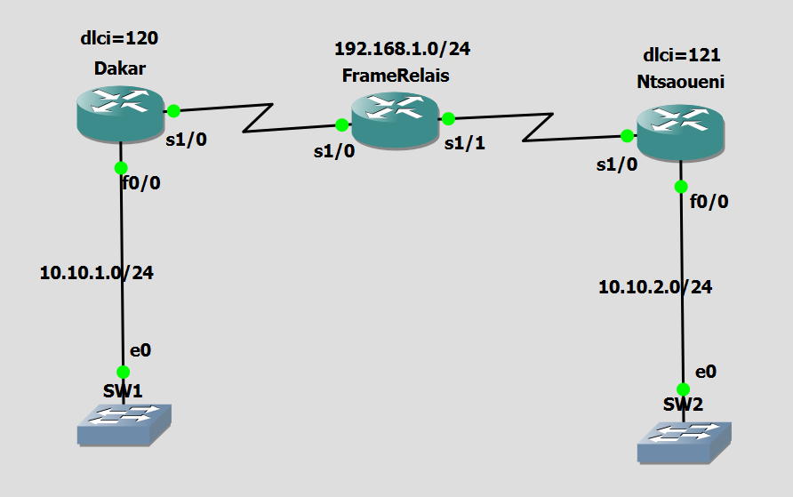
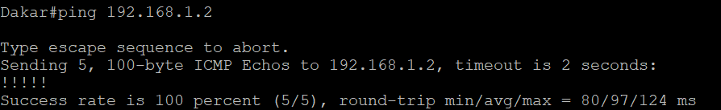

# Exercice 5 — Simple configuration sans Switch

## Topologie (capture d'écran)



```
Dakar (DLCI 120) ---- FrameRelais (routeur DCE) ---- Ntsaoueni (DLCI 121)
   |                                                        |
 SW1 (10.10.1.0/24)                                SW2 (10.10.2.0/24)
```

| Routeur | Adresse IP | DLCI |
|---|---|---|
| Dakar | 192.168.1.1/24 | 120 |
| Ntsaoueni | 192.168.1.2/24 | 121 |
| FrameRelais | — (pas d'IP, relais uniquement) | — |

## 📂 Structure

```
exercice5/
├── README.md
├── Dakar-config.txt
├── Ntsaoueni-config.txt
├── FrameRelais-config.txt
└── captures/
    ├── topologie.png
    ├── ping.png
    ├── show frame-relay route.png
    ├── show frame-relay pvc.png
    ├── show frame-relay map.png
    └── show ip route.png
```

## Objectif

Remplacer le switch Frame Relay natif de GNS3 par un **véritable routeur Cisco configuré en mode commutateur Frame Relay**, à l'aide de la commande globale `frame-relay switching` et de `frame-relay route` sur chaque interface, pour relier deux DLCI distincts (120 et 121) entre Dakar et Ntsaoueni.

> **Point clé :** contrairement aux exercices précédents, ce routeur central n'a aucune adresse IP — il ne fait que commuter les trames Frame Relay d'une interface à l'autre, comme le ferait un vrai équipement d'opérateur télécom.

## Configuration

Voir les fichiers [Dakar-config.txt](Dakar-config.txt), [Ntsaoueni-config.txt](Ntsaoueni-config.txt) et [FrameRelais-config.txt](FrameRelais-config.txt).

## Conclusion

Le relais Frame Relay fonctionne dans les deux sens (`show frame-relay route` confirme le statut `active` pour DLCI 120→121 et 121→120), et la connectivité IP de bout en bout entre Dakar et Ntsaoueni est confirmée par ping.

## 📸 Captures d'écran

### Test de connectivité (ping)


### show frame-relay route (sur FrameRelais)


### show frame-relay pvc


### show frame-relay map


### show ip route
